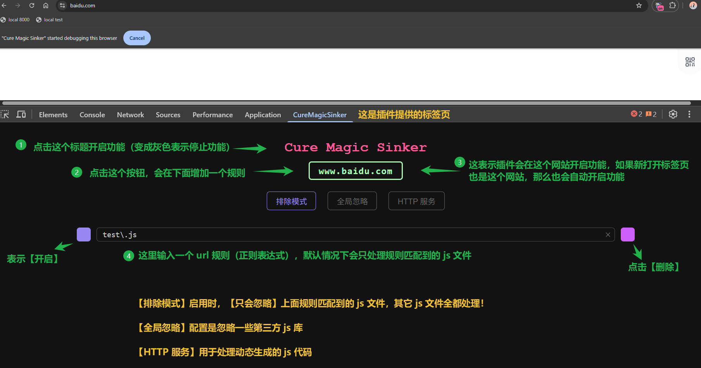
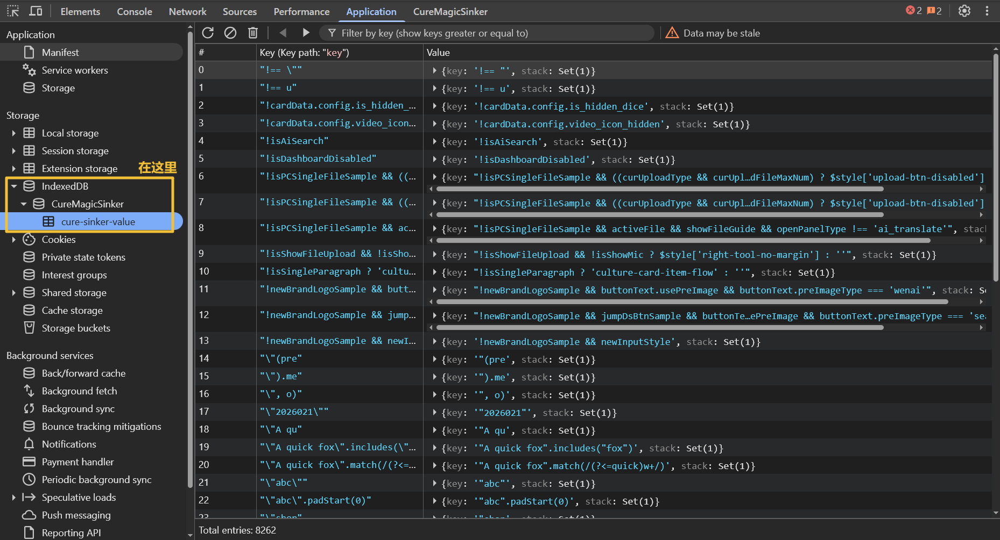
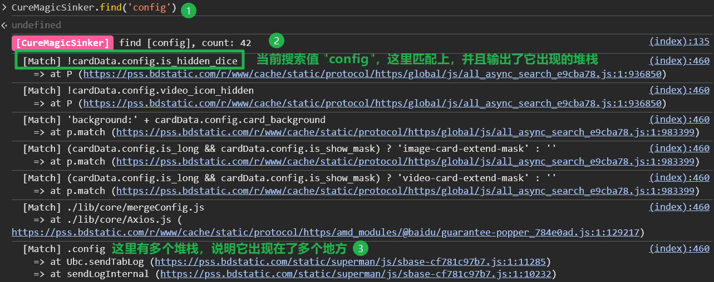
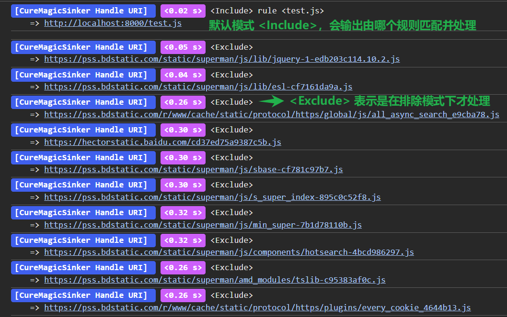
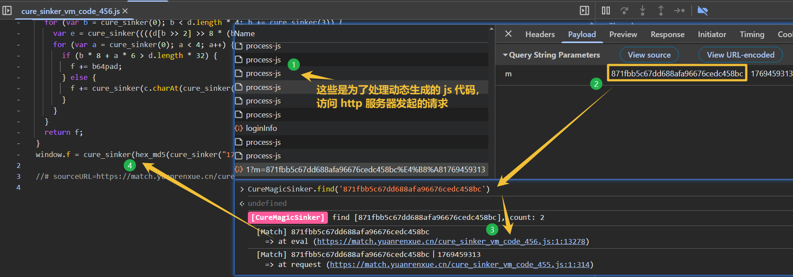

<h1 style="text-align: center; color: #FE5B9B;">Cure Magic Sinker</h1>

为了早日升级，决定冒险去攻略不同地下城，结果几个星期后居然连入口都找不到！

可恶！世界太和平，地下城都不会出现了！这是末法时代吗？！

> 公主：所以还是乖乖地打一千年的野生史莱姆吧！

---

本项目通过修改网站的 JS 代码，记录值生成的位置。

> 公主：随便修改别人东西不太好吧，出问题了怎么办？
>
> 我：没事，到时候就说“虽然我尽力解决，奈何事情先一步发生了”

核心思想参考 [JSREI/ast-record-for-js-RE: 浏览器内存漫游解决方案](https://github.com/JSREI/ast-hook-for-js-RE)。

重点特性说明：

- 使用浏览器插件（仅支持 `Edge/Chrome`）完成网站 JS 文件的重写，可配置正则表达式来忽略 JS 文件
- 使用 [IndexedDB - WebAPI](https://developer.mozilla.org/zh-CN/docs/Web/API/IndexedDB_API) 记录生成的值，关闭网站时自动删除数据库
- **使用 [native messaging](https://developer.chrome.google.cn/docs/extensions/develop/concepts/native-messaging?hl=zh-cn) 和本地程序通信，完全由本地程序使用 [swc](https://github.com/swc-project/swc) 处理 JS 代码**，因为速度够快，所以没有使用缓存 —— **该程序仅支持 `x86_64-pc-windows-msvc`**
- **使用 [@swc/wasm-web](https://swc.rs/docs/usage/wasm) 处理网页中动态生成的 js 代码**。如果动态生成的代码太大，本地程序会开启 HTTP 服务器，通过请求它来处理。服务器端口默认 `9226`。

重要缺点说明：

- 目前没有大范围测试 `\(￣︶￣*\))`，只能保证在主流网站运行正常
- 大范围修改代码很容易被检测，当前还没有加入反检测，现在的重点是稳定核心功能（定位值），具体见 `doc/anti_check.md`
- 如果 html 的响应头中具备 `CSP` 字段，会被插件删除，这是为了方便注入内联脚本
- 处理动态生成的 js 代码需要 `hook eval、Function`，当前没有解决 hook 检测
- 当前也没有解决控制台反调试
- **对于 `jsvmp` 或者控制流混淆，本项目基本无用**

# 使用方法

下载 `release` 并解压，会有两个目录 `dist、dist_native`：

- `dist` 目录是浏览器插件，只支持 `Edge/Chrome` 浏览器，需要手动添加到浏览器中
- `dist_native` 是本地程序，根据该目录下的 `readme.md` 文件完成本地程序的注册

当配置环境之后，启动浏览器、打开插件。打开网站并进入到浏览器控制台后，能看到一个标签页 `CureMagicSinker`。

记录生成的值以及堆栈在这里 —— 数据库的更新有 `5s` 的延迟，这是为了避免大量频繁写入。

在控制台中输入 `CureMagicSinker.find(v)` 进行查询：

- 输入普通的字符串，是忽略大小写的查询
- 可以输入正则表达式

控制台会输出处理了哪些文件、以及它们的耗时。

如果想详细配置 `hook` 代码的逻辑，需要修改 `dist_native/cure_magic_sinker_core.js` —— 非常原始的配置，完全写代码来控制了，其实这样也不好，代码挤在一起了。

推荐直接修改 `cure_magic_sinker_core` 目录中的代码（我尽可能多加注释、拆分文件），然后使用 `npm run build-core` 编译，这样每次刷新网站都能使用最新的代码。

- `cure_sinker_hook()` 是核心的 hook 方法
- `filter_setting.filter()` 可以自定义值的过滤逻辑，返回 `true` 表示忽略不会记录
- 默认情况下，如果字符串长度不在 `[5, 500]` 范围则忽略，不会记录

> 公主：你也太偷懒了吧，居然会有这么原始的做法？！ (\* ￣︿￣)
>
> 我：这。。我。。。我觉得很不错呀，至少各部分没有紧紧联系。要是弄个配置界面，用起来的人当然舒服啦，我要解决的问题可就多了，那当然是为我自己考虑嘛
>
> 公主：(￣﹏￣；) 那行吧，好感度 `↓ 20`

## 举例

以 [猿人学第一题](https://match.yuanrenxue.cn/match/1) 为例，可以直接定位到 `eval` 中。

> 公主：就不能来点有难度的 (⊙o⊙)？
>
> 我：额。。。这。。我。。唔。。下次一定 >\_<
>
> 公主：该不会是其它的都不行吧？ (。・∀・)ノ
>
> 我：。。。。。。。才，才不会！

## 简单反调试

当前仅提供简单的过反调试，比如禁用控制台输出（避免干扰 Hook 代码的输出）、删除 `debugger` 语句（顺手的事）等，更强的过反调试、反检测不是本项目的目标。

> 公主：！！！￣へ￣
>
> 我：(￣m￣）

# 目录说明

`/src`: 浏览器插件。插件基于 `manifest v3` 标准，重写响应使用需要 [Chrome DevTools Protocol](https://chromedevtools.github.io/devtools-protocol/)，所以仅支持 `Edge/Chrome`。

`/native_host`: 插件的本地程序，使用 `rust` 开发，可以单独使用，见 `lib.rs`。

`/cure_magic_sinker_core`: 核心 hook 代码，可以单独使用。

`/doc`：设计文档，参考价值极高

> 公主：不要把垃圾堆说成是宝库呀！w(ﾟДﾟ)w
>
> 我：？！那是思想的结晶！就..就算是...你不也天天来垃圾堆里逛 <-\_<-

# Attribution

[Extension Icon](https://www.flaticon.com/free-icon/bag_8382018)
